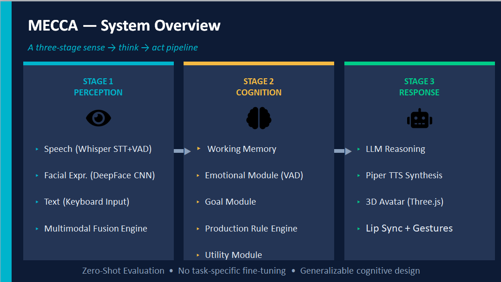

<div align="center">

# 🧠 MECCA

### **Multimodal Emotional & Cognitive Conversational Agent**

*A real-time multimodal AI platform that combines speech, vision, cognitive reasoning, and large language models to deliver emotionally aware human-computer interaction.*

<p align="center">


</p>

<p align="center">


</p>

</div>

---

## 🌟 Overview

MECCA (**Multimodal Emotional & Cognitive Conversational Agent**) is a real-time conversational AI platform designed to emulate more natural and emotionally aware human-computer interaction.

Unlike traditional chatbot architectures that directly connect user input to a language model, MECCA introduces a **cognitive reasoning layer** inspired by classical cognitive architectures such as **ACT-R** and **SOAR**. The system continuously perceives multimodal signals—including speech, facial expressions, and textual input—before maintaining contextual state, reasoning over user emotion, selecting cognitive actions, and generating empathetic responses through a Large Language Model.

The project integrates modern AI technologies—including **FastAPI**, **WebSockets**, **Faster-Whisper**, **DeepFace**, **GPT-4o-mini**, **Piper TTS**, and **Three.js**—into a unified architecture capable of supporting responsive, emotionally intelligent virtual agents.

---

### ✨ Highlights

- 🎤 Real-time speech interaction using Faster-Whisper
- 😊 Facial emotion recognition using DeepFace
- 💬 Text, speech, and vision multimodal fusion
- 🧠 Custom cognitive architecture with seven internal reasoning modules
- ❤️ Emotion-aware response generation using Valence-Arousal-Dominance (VAD)
- 🤖 GPT-4o-mini powered contextual reasoning
- 🔊 Offline neural speech synthesis using Piper TTS
- 👤 Real-time 3D avatar animation with Three.js
- ⚡ FastAPI backend with WebSocket streaming

---

# 🎥 Demo Preview

<p align="center">

> 🚧 **Demo Video Coming Soon**

*A complete demonstration showcasing MECCA's real-time multimodal interaction, cognitive reasoning pipeline, emotion-aware response generation, and avatar synchronization will be available soon.*

</p>

<p align="center">


</p>

### Demo Highlights

The demonstration showcases the complete interaction pipeline:

- 🎤 Real-time speech recognition using Faster-Whisper
- 😊 Facial emotion recognition through live webcam analysis
- 📝 Text understanding and conversational context management
- 🧠 Cognitive reasoning using working memory, production rules, utility evaluation, and goal management
- ❤️ Emotion-aware response generation
- 🤖 GPT-powered dialogue generation
- 🔊 Neural speech synthesis using Piper TTS
- 👤 Real-time avatar lip synchronization and animation
- 🔄 Continuous multimodal perception and state updates
- 🔄 Continuous working memory and dialogue state updates

> **Status:** Demo video is currently being prepared and will be added in a future release.

---

# 📚 Table of Contents

- [Overview](#-overview)
- [Motivation](#-motivation)
- [Key Features](#-key-features)
- [Architecture Overview](#-architecture-overview)
- [Cognitive Architecture](#-cognitive-architecture)
- [System Workflow](#-system-workflow)
- [Technology Stack](#-technology-stack)
- [Project Structure](#-project-structure)
- [Installation](#-installation)
- [Quick Start](#-quick-start)
- [Configuration](#-configuration)
- [Running the Project](#-running-the-project)
- [Usage Guide](#-usage-guide)
- [Project Screenshots](#-project-screenshots)
- [Engineering Decisions](#-engineering-decisions)
- [Performance & Evaluation](#-performance--evaluation)
- [Future Roadmap](#-future-roadmap)
- [Research Background](#-research-background)
- [Citation](#-citation)
- [Contributing](#-contributing)
- [License](#-license)
- [Author](#-author)
  
---

# 🌍 Overview

MECCA (**Multimodal Emotional & Cognitive Conversational Agent**) is an experimental AI platform for building emotionally intelligent conversational agents capable of perceiving, reasoning, and responding through multiple communication modalities.

Unlike conventional conversational assistants that rely primarily on textual input, MECCA continuously processes **speech**, **facial expressions**, and **textual information** to understand both the semantic content and the emotional state of the user. These multimodal signals are fused into a unified representation that drives a custom cognitive architecture responsible for context management, emotional reasoning, decision making, and response planning.

At the core of MECCA is a modular cognitive framework composed of seven interconnected components:

- Working Memory
- Goal Management
- Utility Evaluation
- Production Rules
- Cognitive Decision Module
- Emotion-Aware Reasoning
- Response Planning

Instead of directly forwarding user input to a Large Language Model, MECCA performs cognitive processing before invoking GPT-based reasoning, enabling responses that are more context-aware, emotionally adaptive, and behaviorally consistent.

The platform follows a modular architecture where each subsystem—including speech recognition, vision processing, multimodal fusion, cognition, language generation, text-to-speech, and avatar rendering—operates independently while communicating through FastAPI and WebSocket services.

This modular design makes MECCA extensible, allowing future integration of Retrieval-Augmented Generation (RAG), long-term semantic memory, agent collaboration, cloud deployment, and additional perception modalities without redesigning the overall architecture.

---

# 💡 Motivation

Recent advances in Large Language Models have significantly improved conversational AI. However, most existing systems remain predominantly text-centric and lack the ability to perceive and reason about non-verbal human communication.

Human conversations naturally involve multiple modalities—including spoken language, facial expressions, tone of voice, and contextual memory—that collectively influence understanding and response generation. Conventional chatbot architectures typically process only textual input, resulting in interactions that often overlook emotional context and user intent.

MECCA was developed to explore a more human-centered approach to conversational AI by combining multimodal perception with cognitive reasoning.

The primary objectives of this project are:

- Develop an emotionally aware conversational framework.
- Integrate speech, vision, and text into a unified perception pipeline.
- Introduce a modular cognitive architecture capable of reasoning before response generation.
- Maintain contextual continuity through working memory.
- Generate responses that consider both semantic meaning and emotional state.
- Provide a scalable foundation for future intelligent virtual agents.

Rather than replacing Large Language Models, MECCA positions the LLM as one component within a broader cognitive system, enabling more structured decision-making and emotionally adaptive interactions.

---

# ✨ Key Features

MECCA integrates multiple AI technologies into a unified cognitive framework for emotionally intelligent human-computer interaction.

## 🎤 Multimodal Perception

- 🎙️ Real-time Speech Recognition using **Faster-Whisper**
- 😊 Facial Emotion Recognition using **DeepFace**
- 💬 Natural Language Understanding through GPT-4o-mini
- 📝 Textual conversation context management

---

## 🧠 Cognitive Intelligence

Unlike conventional chatbot systems, MECCA introduces a dedicated cognitive layer responsible for reasoning before response generation.

The cognitive architecture includes:

- 🗂️ Working Memory
- 🎯 Goal Management
- ⚖️ Utility Evaluation
- 📖 Production Rules
- 🧠 Cognitive Decision Module
- ❤️ Emotion-aware Reasoning
- 💭 Context-aware Response Planning

---

## ❤️ Emotion-Aware Conversations

MECCA continuously estimates the user's emotional state using multimodal signals.

Supported capabilities include:

- Facial emotion recognition
- Text-based sentiment analysis
- Emotion fusion
- Valence-Arousal-Dominance (VAD) modeling
- Emotion-aware prompt generation

---

## 🤖 Intelligent Response Generation

- GPT-4o-mini powered reasoning
- Context-aware conversations
- Emotionally adaptive responses
- Multi-turn dialogue support
- Dynamic prompt engineering

---

## 👤 Interactive AI Avatar

- Real-time avatar animation
- Lip synchronization
- Speech playback
- Live emotion display
- Interactive user interface

---

## ⚡ Real-Time Architecture

- FastAPI backend
- WebSocket communication
- Modular AI services
- Low-latency inference pipeline
- Concurrent multimodal processing

---

## 🔧 Modular & Extensible Design

MECCA is designed as an extensible platform where each subsystem operates independently.

New modules such as:

- Retrieval-Augmented Generation (RAG)
- Long-term Memory
- Multi-Agent Collaboration
- Cloud Deployment
- Vector Databases
- MLOps Pipelines

can be integrated with minimal architectural changes.

---

# 🏗️ Architecture Overview

MECCA follows a modular, service-oriented architecture that separates perception, cognition, reasoning, and interaction into independent components.

This design improves scalability, maintainability, and allows each module to evolve independently.

<p align="center">


</p>

---

## High-Level Architecture

The system consists of four major layers:

| Layer | Responsibility |
|--------|----------------|
| **Perception Layer** | Processes speech, facial expressions, and textual input from the user. |
| **Cognitive Layer** | Maintains working memory, evaluates goals, reasons about context, and determines the next cognitive action. |
| **Reasoning Layer** | Generates emotionally adaptive responses using GPT-4o-mini and contextual prompts. |
| **Interaction Layer** | Produces synthesized speech and controls the animated avatar for natural user interaction. |

Each layer communicates through well-defined interfaces, enabling modular development and independent component upgrades.

### Design Principles

MECCA was designed around the following engineering principles:

- **Modularity** — Independent AI services for speech, vision, cognition, and language.
- **Scalability** — Components can be replaced or upgraded without redesigning the system.
- **Extensibility** — New modalities and reasoning modules can be integrated easily.
- **Real-Time Communication** — WebSocket-based streaming minimizes interaction latency.
- **Separation of Concerns** — Perception, cognition, reasoning, and presentation remain decoupled.

---

# 🧠 Cognitive Architecture

The defining characteristic of MECCA is its custom cognitive architecture, which enables reasoning beyond simple prompt-response interactions.

Instead of directly forwarding user input to a Large Language Model, MECCA performs several intermediate cognitive processes inspired by classical cognitive architectures such as **ACT-R** and **SOAR**.

<p align="center">


</p>

---

## Cognitive Pipeline

The cognitive layer consists of seven collaborating modules:

| Module | Responsibility |
|--------|----------------|
| **Working Memory** | Maintains dialogue history, user context, detected emotions, and recent interactions. |
| **Goal Management** | Determines the conversational objective for the current interaction. |
| **Production Rules** | Applies predefined reasoning rules based on contextual information. |
| **Utility Evaluation** | Scores candidate actions according to contextual relevance and emotional state. |
| **Decision Module** | Selects the most appropriate cognitive action. |
| **Emotion Reasoning** | Integrates multimodal emotion information into response planning. |
| **Response Planner** | Constructs structured prompts before invoking the language model. |

---

## Why a Cognitive Layer?

Most conversational AI systems follow a simple pipeline:

```text
User Input
      │
      ▼
Large Language Model
      │
      ▼
Response
```
---

# 🔄 System Workflow

MECCA processes user interactions through a modular multimodal pipeline.

<p align="center">
  

</p>

The interaction pipeline follows these steps:

1. User provides speech, facial expressions, and text.
2. Speech is transcribed using **Faster-Whisper**.
3. Facial emotions are detected using **DeepFace**.
4. Multimodal signals are fused into a unified representation.
5. The cognitive layer updates working memory and determines the next action.
6. GPT-4o-mini generates an emotion-aware response.
7. Piper TTS synthesizes speech.
8. The avatar delivers synchronized visual and spoken responses.

---

# 🛠 Technology Stack

| Layer | Technology |
|--------|------------|
| Programming Language | Python 3.12 |
| Backend | FastAPI |
| Communication | WebSockets |
| Speech Recognition | Faster-Whisper |
| Emotion Recognition | DeepFace |
| Computer Vision | OpenCV, MediaPipe |
| Language Model | GPT-4o-mini |
| Text-to-Speech | Piper TTS |
| Avatar | Three.js |
| Frontend | HTML, CSS, JavaScript |
| AI Libraries | Transformers, PyTorch |


---

# Section 12 — ⚙️ Installation

---

# ⚙️ Installation

### Clone the repository

```bash
git clone https://github.com/Sadia0701/Multimodal-Emotional-Cognitive-Conversational-Agent.git

cd Multimodal-Emotional-Cognitive-Conversational-Agent
```

### Create a virtual environment
```bash
python -m venv venv

source venv/bin/activate
```
### Windows
```bash
venv\Scripts\activate
```

### Install Dependencies
```bash
pip install -r requirements.txt
```

Detailed setup instructions are available in docs/Installation.md


---


# 🚀 Quick Start

1. Configure your `.env` file.
2. Start the FastAPI backend.

```bash
python backend/main.py
```

3. Launch the frontend.

4. Open your browser and interact with MECCA.

The application will automatically initialize the speech, vision, cognitive, and avatar modules.

---

# ⚙️ Configuration

Before running the project, configure the required environment variables.

| Variable | Description |
|-----------|-------------|
| OPENAI_API_KEY | OpenAI API Key |
| PIPER_MODEL | Piper TTS model |
| WHISPER_MODEL | Faster-Whisper model |
| CAMERA_INDEX | Webcam selection |

Refer to `.env.example` for the complete configuration.

---

# ▶️ Running the Project

Start the backend server:

```bash
python backend/main.py
```

Open the frontend in your browser.

Allow microphone and camera permissions.

Begin interacting with the avatar in real time.

---

# 💬 Usage Guide

1. Allow camera and microphone access.
2. Speak naturally to the avatar.
3. MECCA analyzes speech and facial expressions simultaneously.
4. The cognitive layer reasons over the interaction.
5. An emotion-aware response is generated and spoken by the avatar.

The interface continuously updates detected emotions, cognitive actions, and conversation history during the interaction.


